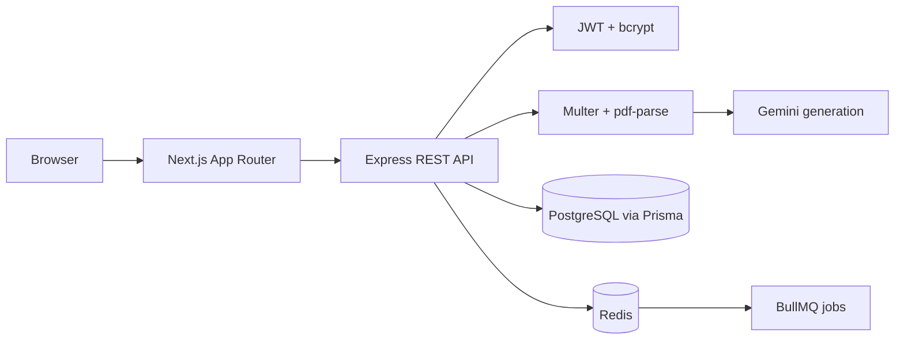

# AI Flashcard Engine

AI Flashcard Engine is a production-grade Turborepo monorepo for turning uploaded PDFs into AI-generated flashcards, reviewing them with spaced repetition, and tracking learning progress.

## Architecture



## Stack

- Monorepo: Turborepo, npm workspaces, TypeScript
- Frontend: Next.js 14, React, Tailwind CSS, shadcn-style UI primitives, Zustand, TanStack Query
- Backend: Node.js, Express, REST, Zod, Pino
- Data: PostgreSQL, Prisma ORM
- AI: Gemini API via Google GenAI SDK for structured flashcard generation
- Auth: JWT and bcrypt
- Uploads: Multer and PDF parsing
- Jobs: BullMQ with Redis
- Tests: Jest and Supertest

## Structure

```text
apps/
  web/      Next.js frontend
  api/      Express backend
packages/
  ui/       Shared React components
  database/ Prisma schema and client
  config/   Shared ESLint and TypeScript config
  types/    Shared TypeScript contracts
  utils/    Shared utilities and SM-2 scheduling
```

## Getting Started

1. Install dependencies:

```bash
npm install
```

2. Create local environment:

```bash
cp .env.example .env
```

3. Start Postgres and Redis:

```bash
docker compose up postgres redis
```

4. Generate Prisma client and migrate:

```bash
npm run db:generate
npm run db:migrate
```

5. Run the monorepo:

```bash
npm run dev
```

The web app runs on `http://localhost:3000` and the API runs on `http://localhost:4000`.

## Environment Variables

```env
DATABASE_URL=
JWT_SECRET=
GEMINI_API_KEY=
REDIS_URL=
API_PORT=
NEXT_PUBLIC_API_URL=
```

`GEMINI_API_KEY` is optional for local smoke testing. Without it, the API uses a deterministic fallback generator so uploads still create starter cards.

## API

### Auth

- `POST /auth/register`
  - Body: `{ "email": "user@example.com", "password": "password123" }`
- `POST /auth/login`
  - Body: `{ "email": "user@example.com", "password": "password123" }`
- `GET /auth/me`
  - Header: `Authorization: Bearer <token>`

### Decks

- `GET /decks`
- `POST /decks`
  - Body: `{ "title": "Biology", "description": "Chapter notes" }`
- `GET /decks/:id`
- `GET /decks/:id/flashcards`
- `GET /decks/study-queue`
  - Query: `limit`, `newLimit`, optional `deckId`
  - Returns due cards ordered by `next_review_date`, followed by a small batch of unseen cards
- `POST /decks/review`
  - Body: `{ "flashcardId": "...", "rating": 4 }`
  - Updates `StudyData` with SM-2 `review_count`, `ease_factor`, `interval`, and `next_review_date`

### Upload

- `POST /upload`
  - Header: `Authorization: Bearer <token>`
  - Multipart fields:
    - `file`: PDF
    - `title`: optional deck title
    - `description`: optional deck description

## Scripts

```bash
npm run dev
npm run build
npm run lint
npm run test
npm run format
npm run db:migrate
npm run db:studio
```

## Docker

Run the full stack:

```bash
docker compose up --build
```

For a fresh database, run migrations from the host after services are healthy:

```bash
npm run db:migrate
```

## Deployment

- Frontend: deploy `apps/web` to Vercel and set `NEXT_PUBLIC_API_URL` to the API URL.
- Backend: deploy the root Dockerfile to Render or Railway with `APP=@flashcard/api`.
- Postgres: use Supabase or Neon and set `DATABASE_URL`.
- Redis: use Upstash Redis and set `REDIS_URL`.
- Secrets: set `JWT_SECRET` to a long random value and provide `GEMINI_API_KEY` in production.

## Production Notes

- Auth routes hash passwords with bcrypt and issue 7-day JWTs.
- API inputs are validated with Zod.
- Errors are centralized through Express middleware.
- Logs use Pino and request logging through `pino-http`.
- Prisma models use cascading relationships and indexes for user decks, deck cards, due reviews, and review history.
- Spaced repetition state lives in `study_data`, keyed by user and flashcard, so shared decks can be supported later.
- The upload endpoint stores generated flashcards immediately and also touches the BullMQ queue so background processing can be expanded without changing clients.
